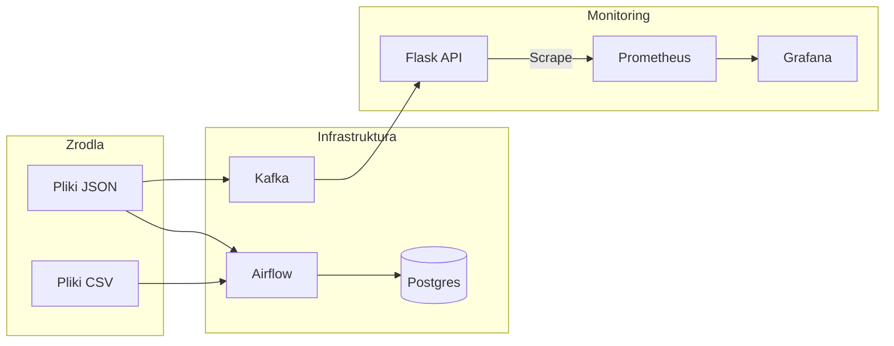

# DataProjectV1.0

Flask
http://localhost:5000/

Grafana 
http://localhost:3000/login

Prometheus
http://localhost:9090/query

Elastgicsearch
http://localhost:5601/app/integrations/browse

Kibana
http://localhost:9200/

Elasticvue
http://localhost:8080/welcome

UI for Apache Kafka
http://localhost:8081/

Flask
http://localhost:5000/filescsv
http://localhost:5000/filesjson/cars.json
http://localhost:5000/filescsv/test_data.csv

Usługa,Adres URL,Opis
Flask API,http://localhost:5000,Główna aplikacja i serwer danych
Airflow,http://localhost:8082,Orkiestracja zadań ETL (DAGs)
Kafka UI,http://localhost:8081,Interfejs do zarządzania klastrem Kafka
Grafana,http://localhost:3000,Dashboardy i wizualizacja metryk
Prometheus,http://localhost:9090,Silnik metryk i zapytań Time-Series
Kibana,http://localhost:5601,Eksploracja logów w Elasticsearch
Elasticvue,http://localhost:8080,Lekki przeglądarkowy klient Elasticsearch
Elasticsearch,http://localhost:9200,Silnik wyszukiwania (REST API)

podman exec -it flask_app flask routes

---------------
Jako Twój Mentor IT wyjaśnię Ci, jak w praktyce sterować tym trybem. W Airflow nie zmieniamy kodu za każdym razem, gdy chcemy coś sprawdzić – wykorzystujemy do tego Zmienne (Variables).

1. Aktywacja przez GUI (Najprostsza metoda)
Aby tryb debugowania zaczął działać w Twoich DAG-ach, musisz dodać odpowiedni klucz w panelu administracyjnym:

Zaloguj się do Airflow UI (localhost:8082).

W górnym menu wybierz Admin -> Variables.

Kliknij przycisk + (Add a new record).

Wypełnij pola:

Key: debug_mode

Val: True (wpisz to jako tekst, Airflow i tak zinterpretuje to w kodzie).

Kliknij Save.

2. Aktywacja przez CLI (Szybka metoda)
Jeśli wolisz terminal (co jako nauczyciel informatyki pewnie doceniasz), możesz to zrobić jedną komendą wewnątrz kontenera:

Bash

podman exec -it airflow_scheduler airflow variables set debug_mode True
3. Jak sprawdzić efekty? (Tryb 2)
Kiedy debug_mode jest ustawiony na True, Airflow zacznie zapisywać dodatkowe linie w logach zadania insert_new_files.

Uruchom DAG przyciskiem Trigger DAG.

Wejdź w ostatnie uruchomienie, wybierz task insert_new_files i kliknij Logs.

Szukaj linii oznaczonych jako INFO (lub DEBUG w zależności od konfiguracji), które zaczynają się od słowa: DEBUG: Pliki w folderze: [...] DEBUG: Pliki w bazie: [...]

Mentor IT: Dlaczego to jest "Clean Code"? (Tryb 2)
Brak ingerencji w kod: Nie ryzykujesz, że przypadkowo zostawisz print() lub breakpoint() w kodzie produkcyjnym.

Centralne sterowanie: Jedna zmienna może kontrolować debugowanie we wszystkich Twoich DAG-ach (CSV i JSON) jednocześnie.

Bezpieczeństwo: Możesz włączyć debugowanie na 5 minut, sprawdzić co się dzieje, i wyłączyć je, zmieniając wartość na False, bez konieczności robienia git commit czy restartowania kontenerów.

---------------------
Jako Twój Mentor IT wyjaśnię Ci, że sterowanie tymi trybami odbywa się w dokładnie tym samym miejscu, co w przypadku debug_mode. Masz dwie główne drogi:

1. Przez Interfejs Graficzny (Airflow UI) – Najwygodniej
To tam najczęściej będziesz zaglądał jako administrator systemu.

Zaloguj się do Airflow (zazwyczaj localhost:8082).

W górnym menu wybierz Admin -> Variables.

Jeśli zmienna dry_run już istnieje: kliknij ikonę ołówka (Edit) i zmień True na False (aby zacząć zapisywać dane) lub odwrotnie.

Jeśli nie istnieje: kliknij +, w polu Key wpisz dry_run, a w polu Val wpisz False.

2. Przez Terminal (CLI) – Najszybciej
Jeśli pracujesz w konsoli i chcesz szybko przełączyć tryb bez odrywania rąk od klawiatury:

Aby wyłączyć Dry Run (ZACZĄĆ zapisywać do bazy):

Bash

podman exec -it airflow_scheduler airflow variables set dry_run False
Aby włączyć Dry Run (ZABLOKOWAĆ zapisy - tryb bezpieczny):

Bash

podman exec -it airflow_scheduler airflow variables set dry_run True
Mentor IT: Profesjonalna porada (Tryb 2)
Dlaczego zrobiliśmy to w ten sposób (przez Variable)?

Bezpieczeństwo (Hot-swapping): Możesz zmienić zachowanie działającego systemu bez restartowania kontenerów i bez edycji plików .py.

Centralizacja: Ta jedna zmienna steruje teraz wszystkimi Twoimi DAGami (o ile w nich też dodasz obsługę dry_run).

Pamiętaj o pułapce: W Pythonie Variable.get zwraca stringa. W kodzie, który Ci przygotowałem, Airflow automatycznie rzutuje popularne wartości (jak "True"/"False") na typ Boolean, ale dobrą praktyką jest upewnienie się, że wpisujesz je w UI wielką literą (True / False), aby uniknąć nieporozumień.

